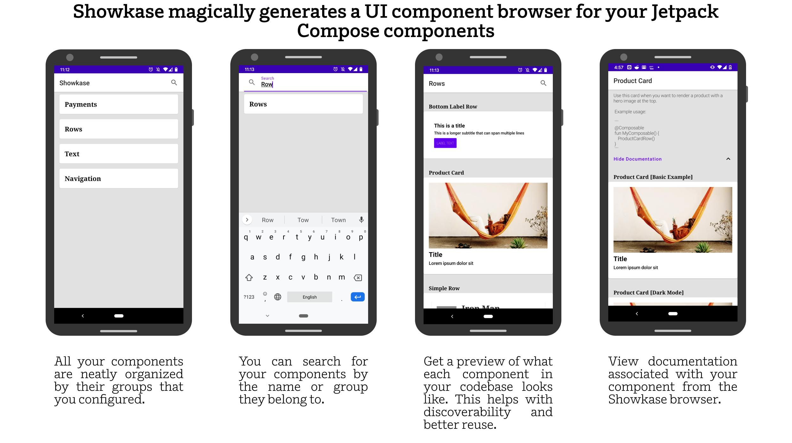
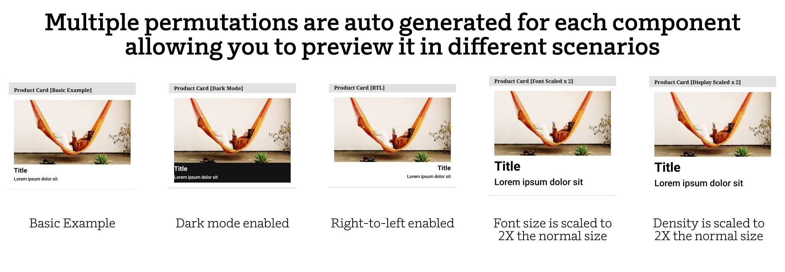
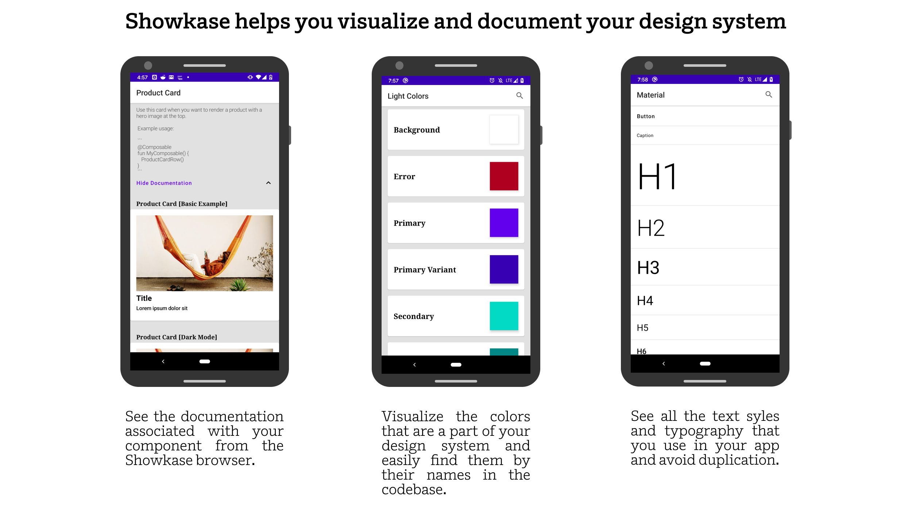

# Showkase

Showkase is an annotation-processor based Android library that helps you organize, discover, search 
and visualize Jetpack Compose UI elements. It magically generates a UI browser with very minimal 
effort. In addition, it also helps you visualize your components in common situations like dark mode, 
RTL layouts, font scaled, etc.  

<p align="center">
    
</p>

<p align="center">
    
</p>

<p align="center">
    
</p>

<table align="center" style="width:100%">
    <tr>
        <td></td>
        <td></td>
    </tr>
</table>
 
 ## Why should you use Showkase?
 - Showkase eliminates the manual work needed in maintaining a UI preview/browser app that 
 each company is forced to build in order to maintain their design system.
 - Since all the available UI elements are now easily searchable and discoverable, there is better 
 reuse of UI elements in your repo. This makes it super useful for maintaining consistency across 
 your app. The biggest problem for enforcing a design system is discoverability and Showkase 
 hopefully solves that problem for your team.
 - It allows you to quickly visualize `@Composable` components, `Color` properties and `TextStyle
 (Typography)` as you are building them. The goal is to improve the turnaround time in creating a 
  production-ready UI elements.
 - Showkase aids in catching common UI issues early with the help of auto-generated permutations 
 of your components.
 
 ## Features
  - [Super simple setup](#Installation)
  - Support for visualizing composables(`@ShowkaseComposable`), colors(`@ShowkaseColor`) & 
  typography(`@ShowkaseTypography`). 
  - First class support for `@Preview` annotation. If you are already using `@Preview` 
  for previews in Android Studio, using Showkase is even easier as all those components are 
  included in the Showkase browser.  
  - Support for top level, class, object & companion object functions and properties to be 
  annotated with the Showkase annotations.
  - 5 Permutations are auto created for each composable (Basic Example, Dark Mode, RTL, Font 
  Scaled, Display Scaled. Look in the gif above for examples)'. More to be added in the future!
  - Support for searching a Showkase UI element by name or group.
  - KDoc support that shows the documentation that you added for a component in the Showkase browser. 
  - Multi-module support for showcasing UI elements across multiple modules.
  - Support for constraining a component with a custom height/width using additional parameters in 
  the annotation.
  - Descriptive error messages so that the users of the library can fix any incorrect setup.
  - Incremental annotation processor that makes the code-gen more performant. 

## Installation

Using Showkase is really straightforward and takes less than a couple minutes to get started.

**Step 1**: Add the dependency to your module's `build.gradle` file. If you have a multi-module 
setup, add this dependency to all the modules with UI elements that should be displayed inside the 
Showkase browser.

```kotlin
implementation "com.airbnb.android:showkase:1.0.0-alpha"
kapt "com.airbnb.android:showkcase-processor:1.0.0-alpha"
```

**Step 2**: Add the relevant annotations for every UI element that should be a part of the 
Showkase browser. 

For `@Composable` components, you can either use the `@Preview` annotation or the 
`@ShowkaseComposable` annotation: 

```kotlin
@Preview(name = "Custom name for component", group = "Custom group name")
@Composable
fun MyComponent() { ... }

// or

@ShowkaseComposable(name = "Name of component", group = "Group Name")
@Composable
fun MyComponent() { ... }
```

For `Color` properties, you can add the `@ShowkaseColor` annotation to the field:

```kotlin
@ShowkaseColor(name = "Primary Color", group = "Material Design")
val primaryColor = Color(0xFF6200EE)
```

For `TextStyle` properties that are useful for typography, you can add the `@ShowkaseTypography` 
annotation to the field:

```kotlin
@ShowkaseTypography(name = "Custom name for style", group = "Custom group name")
val h1 = TextStyle(
    fontWeight = FontWeight.Light,
    fontSize = 96.sp,
    letterSpacing = (-1.5).sp
)
```

**Step 3**: Define an implementation of the `ShowkaseRootModule` interface in your **root** module.
 If your setup involves only a single module, add this implementation in that module. Ensure that this 
implementation is also annotated with the `@ShowkaseRoot` annotation.

```kotlin
@ShowkaseRoot
class MyRootModule: ShowkaseRootModule
```

**Step 4**: Showkase is now ready for use! Just start the `ShowkaseBrowserActivity` to access it. 
Typically you would start this activity from the debug menu of your app but you are free to start 
this from any place you like! `ShowkaseBrowserActivity` comes with a nice helper function that 
returns the intent you need to start. Just pass in the context & the `canonicalName` of the root 
module you created in `Step3`.
 

```kotlin
startActivity(ShowkaseBrowserActivity.getIntent(this, MyRootModule::class.java.canonicalName!!))
```

## Documentation

###### @ShowkaseComposable
Used to annotate `@Composable` functions that should be displayed inside the Showkase browser. 
Here's how you would use it with your @Composable function:

```kotlin
@ShowkaseComposable(name = "Name", group = "Group")
@Composable
fun MyComposable() {
    .......
    .......
}
```

If you are using the `@Preview` annotation with your `@Composable` function already then you 
don't need to use this annotation. Showkase has first class support for `@Preview`. 


Note: Make sure that you add this annotation to only those functions that don't accept any 
parameters. This is similar to how `@Preview` works in Compose as well. `@Preview` recently added
support for parameters that are annotated with `@PreviewParameter` and Showkase will add support 
for that soon. If your function accepts a parameters, wrap it inside another function that doesn't 
accept any parameters. 

For example, here is a @Composable function that requires parameters -

```kotlin
@Composable
fun MyComposable(name: String) {
    .......
    .......
}
```

In order to make this function compatible with Showkase, you could further wrap this function 
inside a method that doesn't accept a parameters in the following way:

```kotlin
@ShowkaseComposable(name = "Name", group = "Group")
@Composable
fun MyComposablePreview() {
    MyComposable("Name")
}
```

`@ShowkaseComposable` currently supports the following properties:

Property Name | Descrciption
------------- | -------------
<b>name</b>| The name that should be used to describe your @Composable function. If you don't pass any value, the name of the composable function is used as the name.
<b>group</b> | The grouping key that will be used to group it with other @Composable functions. This is useful for better organization and discoverability of your components. If you don't pass any value for the group, the name of the class that wraps this function is used as the group name. If the function is a top level function, the composable is added to a "Default Group".
<b>widthDp</b> | The width that your component will be rendered in inside the Showkase browser. Use this to restrict the size of your preview inside the Showkase browser.
<b>heightDp</b> | The height that your component will be rendered in inside the Showkase browser. Use this to restrict the size of your preview inside the Showkase browser.


## Frequently Asked Questions
<details>
  <summary>Is Airbnb using Jetpack Compose in their main app?</summary>
  Since Jetpack Compose is still super early, we haven't started using Compose just yet. However,
  given our history with declarative UI(we created <a href="https://github.com/airbnb/epoxy">Epoxy</a>), 
  we are super excited about Compose and are hoping to be able to use it once the API's are more 
  stable. 
</details>

<details>
  <summary>Why did you create this library if you aren't using Compose in production?</summary>
  One of the biggest barriers to adopting new technology is the lack of tooling that you are 
  otherwise used to having. We currently have an internal tool that works exactly like Showkase 
  but for classic Android. We created Showkase to ensure that we have the tooling available to be
  able to move to Compose in the future. Moreover, we think that this tool would benefit 
  everyone who's using Compose so we decided to open source it. Hopefully we can learn along with
  the community and add features that would benefit everyone. 
</details>

<details>
  <summary>Can I contribute to this library?</summary>
  Pull requests are welcome! We'd love help improving this library. Feel free to browse through 
  <a href="https://github.com/airbnb/Showkase/issues">open issues</a> to look for things that need 
  work. If you have a feature request or bug, please open a new issue so we can track it.
</details>

<details>
  <summary>How do I provide feedback?</summary>
  The <a href="https://github.com/airbnb/Showkase/issues">issues</a> tab is the best place to do 
  that. 
</details>

<details>
  <summary>
    Why can't we have a single annotation like `Showkase` for all the UI elements? Why did you 
    create a different annotation for each UI element(@ShowkaseComposable for composables, 
    @ShowkaseColor for colors & @ShowkaseTypography for text styles)?
  </summary>
  This was done mostly for future proofing. Even though these annotations have the same 
  properties right now, it's possible that they will diverge as we add more features. Once more 
  people start using this library, we will get a more clear idea about whether that needs to 
  happen or not. If we find that it didn't evolve the way we expected, we will consider 
  consildating these annotations. 
</details>

## Coming Soon!

Here are some ideas that we are thinking about. We are also not limited to these and would love 
to learn more about your use cases.

- Hooks for screenshot testing. Since all your components are a part of the Showkase browser, 
this would be a good opportunity to make this a part of your CI and detect diffs in components. 
- Support for other UI elements that are a part of your design system (like icons, spacing, etc)

## Contributing
Pull requests are welcome! We'd love help improving this library. Feel free to browse through 
open issues to look for things that need work. If you have a feature request or bug, please open 
a new issue so we can track it.

## License

```
Copyright 2020 Airbnb, Inc.

Licensed under the Apache License, Version 2.0 (the "License");
you may not use this file except in compliance with the License.
You may obtain a copy of the License at

   http://www.apache.org/licenses/LICENSE-2.0

Unless required by applicable law or agreed to in writing, software
distributed under the License is distributed on an "AS IS" BASIS,
WITHOUT WARRANTIES OR CONDITIONS OF ANY KIND, either express or implied.
See the License for the specific language governing permissions and
limitations under the License.
```
