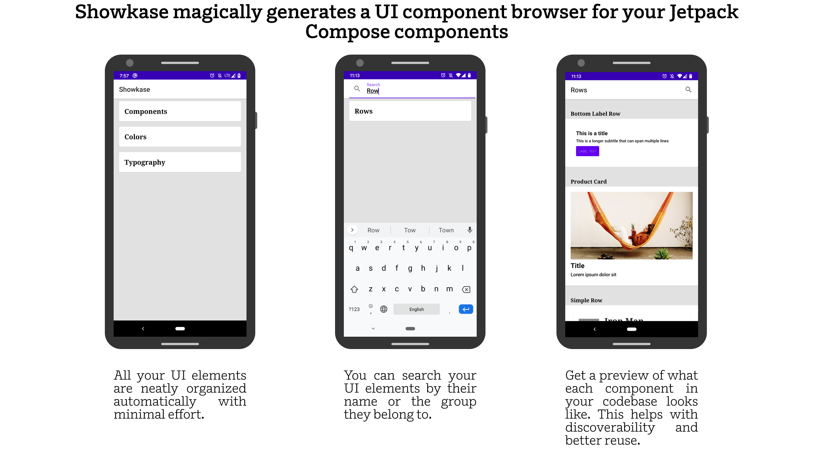

# Showkase

Showkase is an Android library that helps you organize, discover, search and visualize Jetpack 
Compose components(composables). It magically generates a UI component browser with very minimal 
effort. In addition, it also helps you visualize your components in common situations like dark 
mode, RTL layouts, font scaled, etc.  

<p align="center">
    
</p>

<p align="center">
    
</p>

<p align="center">
    
</p>
 
 ## Why should you use Showkase?
 - Showkase eliminates the manual work needed in maintaining a UI component preview/browser app that 
 each company is forced to build
 - Since all the available UI components are now easily searchable and discoverable, there is better 
 reuse of the components in your repo. This makes it super useful for maintaining consistency across 
 your app. The biggest problem for enforcing a design system is discoverability and Showkase 
 hopefully solves that problem for your team.
 - It allows you to quickly visualize `@Composable` components as you are building them. The goal is
  to improve the turnaround time in creating a production-ready component.
 - Showkase aids in catching common UI issues early with the help of auto-generated permutations 
 of your components.
 
 ## Features
  - [Super simple setup](#Installation)
  - Support for top level functions and class functions to be annotated with the `@Showkase` annotation.
  - 5 Permutations are auto created for each composable (Basic Example, Dark Mode, RTL, Font 
  Scaled, Display Scaled. Look in the gif above for examples)'. More to be added in the future!
  - Support for searching a `@Composable` component by name or group.
  - Multi-module support for showcasing composables across multiple modules.
  - Support for constraining a component with a custom height/width using additional parameters in 
  the `@Showkase` annotation.
  - Descriptive error messages so that the users of the library can fix any incorrect setup.
  - Incremental annotation processor that makes the code-gen more performant. 

## Installation

Using Showkase is really straightforward and takes less than a couple minutes to get started.

**Step 1**: Add the dependency to your module's `build.gradle` file. If you have a multi-module 
setup, add this dependency to all the modules which have a `@Composable` function that you want to 
display inside the Showkase browser.

```kotlin
implementation "com.airbnb.android:showkase:0.1.0-alpha"
kapt "com.airbnb.android:showkcase-processor:0.1.0-alpha"
```

**Step 2**: Add the `@Preview` or `@Showkase` annotation to every `@Composable` function/component 
that should be a part of the Showkase browser. Showkase currently supports the following 
properties for both the annotations: `name`, `group`, `widthDp` & `heightDp`.

```kotlin
@Preview(name="Name of component", group="Group Name")

// or

@Showkase(name="Name of component", group="Group Name")
```

**Step 3**: Define an implementation of the `ShowkaseRootModule` interface in your **root** module.
 If your setup involves only a single module, add this implementation in that module. Ensure that this 
implementation is also annotated with the `@ShowkaseRoot` annotation.

```kotlin
@ShowkaseRoot
class MyRootModule: ShowkaseRootModule
```

**Step 4**: Showkase is now ready for use! Just start the `ShowkaseBrowserActivity` to access it. 
Typically you would start this activity from the debug menu of your app but you are free to start 
this from any place you like! `ShowkaseBrowserActivity` comes with a nice helper function that 
returns the intent you need to start. Just pass in the context & the `canonicalName` of the root 
module you created in `Step3`.
 

```kotlin
startActivity(ShowkaseBrowserActivity.getIntent(this, MyRootModule::class.java.canonicalName!!))
```

## Coming Soon!

Here are some ideas that we are thinking about. We are also not limited to these and would love 
to learn more about your use cases.

- Support for representing more aspects of your design system. Think `@ShowkaseColor`, 
`@ShowkaseTypography`, etc.
- Hooks for screenshot testing. Since all your components are a part of the Showkase browser, 
this would be a good opportunity to make this a part of your CI and detect diffs in components. 

## Contributing
Pull requests are welcome! We'd love help improving this library. Feel free to browse through 
open issues to look for things that need work. If you have a feature request or bug, please open 
a new issue so we can track it.

## License

```
Copyright 2020 Airbnb, Inc.

Licensed under the Apache License, Version 2.0 (the "License");
you may not use this file except in compliance with the License.
You may obtain a copy of the License at

   http://www.apache.org/licenses/LICENSE-2.0

Unless required by applicable law or agreed to in writing, software
distributed under the License is distributed on an "AS IS" BASIS,
WITHOUT WARRANTIES OR CONDITIONS OF ANY KIND, either express or implied.
See the License for the specific language governing permissions and
limitations under the License.
```
